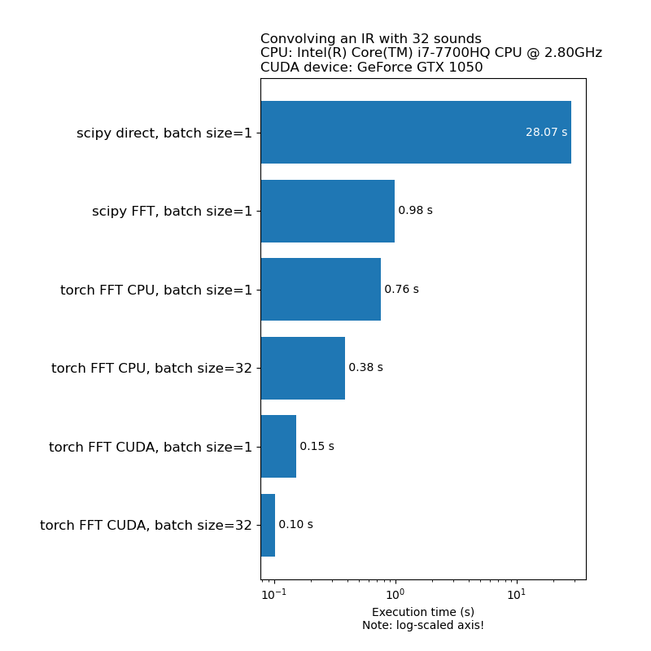
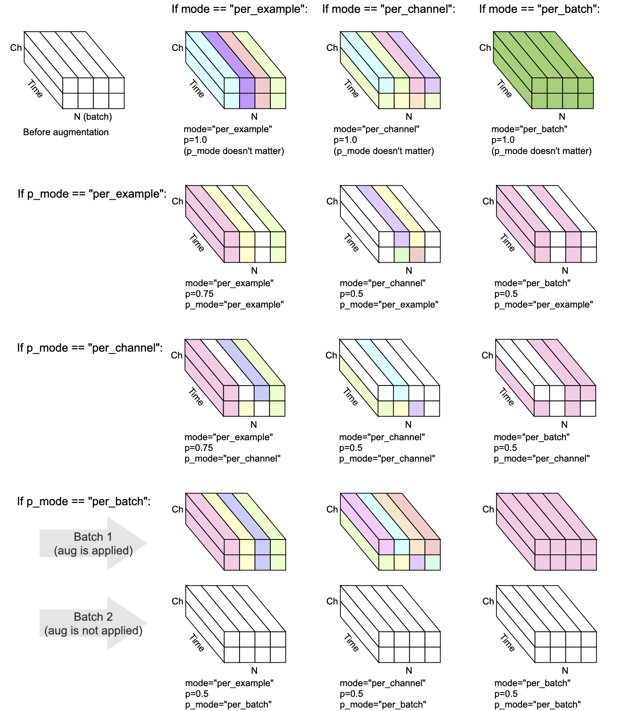

---

 [](https://codecov.io/gh/asteroid-team/torch-audiomentations) [](https://github.com/ambv/black) [](https://doi.org/10.5281/zenodo.5477348)

Audio data augmentation in PyTorch. Inspired by [audiomentations](https://github.com/iver56/audiomentations).

* Supports CPU and GPU (CUDA) - speed is a priority
* Supports batches of multichannel (or mono) audio
* Transforms extend `nn.Module`, so they can be integrated as a part of a pytorch neural network model
* Most transforms are differentiable
* Three modes: `per_batch`, `per_example` and `per_channel`
* Cross-platform compatibility
* Permissive MIT license
* Aiming for high test coverage

# Setup


[](https://pypi.org/project/torch-audiomentations/)
[](https://pypi.org/project/torch-audiomentations/)

`pip install torch-audiomentations`

# Usage example

```python
import torch
from torch_audiomentations import Compose, Gain, PolarityInversion


# Initialize augmentation callable
apply_augmentation = Compose(
    transforms=[
        Gain(
            min_gain_in_db=-15.0,
            max_gain_in_db=5.0,
            p=0.5,
        ),
        PolarityInversion(p=0.5)
    ]
)

torch_device = torch.device("cuda" if torch.cuda.is_available() else "cpu")

# Make an example tensor with white noise.
# This tensor represents 8 audio snippets with 2 channels (stereo) and 2 s of 16 kHz audio.
audio_samples = torch.rand(size=(8, 2, 32000), dtype=torch.float32, device=torch_device) - 0.5

# Apply augmentation. This varies the gain and polarity of (some of)
# the audio snippets in the batch independently.
perturbed_audio_samples = apply_augmentation(audio_samples, sample_rate=16000)
```

# Contribute

Contributors welcome! 
[Join the Asteroid's slack](https://join.slack.com/t/asteroid-dev/shared_invite/zt-cn9y85t3-QNHXKD1Et7qoyzu1Ji5bcA)
to start discussing about `torch-audiomentations` with us.

# Motivation: Speed

We don't want data augmentation to be a bottleneck in model training speed. Here is a
comparison of the time it takes to run 1D convolution:



# Current state

torch-audiomentations is in an early development stage, so the APIs are subject to change.

# Waveform transforms

Every transform has `mode`, `p`, and `p_mode` -- the parameters that decide how the augmentation is performed.
- `mode` decides how the randomization of the augmentation is grouped and applied.
- `p` decides the on/off probability of applying the augmentation.   
- `p_mode` decides how the on/off of the augmentation is applied.

This visualization shows how different combinations of `mode` and `p_mode` would perform an augmentation.    


    

## AddBackgroundNoise

_Added in v0.5.0_

Add background noise to the input audio.

## AddColoredNoise

_Added in v0.7.0_

Add colored noise to the input audio.

## ApplyImpulseResponse

_Added in v0.5.0_

Convolve the given audio with impulse responses.

## BandPassFilter

_Added in v0.9.0_

Apply band-pass filtering to the input audio.

## Gain

_Added in v0.1.0_

Multiply the audio by a random amplitude factor to reduce or increase the volume. This
technique can help a model become somewhat invariant to the overall gain of the input audio.

Warning: This transform can return samples outside the [-1, 1] range, which may lead to
clipping or wrap distortion, depending on what you do with the audio in a later stage.
See also https://en.wikipedia.org/wiki/Clipping_(audio)#Digital_clipping

## HighPassFilter

_Added in v0.8.0_

Apply high-pass filtering to the input audio.

## LowPassFilter

_Added in v0.8.0_

Apply low-pass filtering to the input audio.

## PeakNormalization

_Added in v0.2.0_

Apply a constant amount of gain, so that highest signal level present in each audio snippet
in the batch becomes 0 dBFS, i.e. the loudest level allowed if all samples must be between
-1 and 1.

This transform has an alternative mode (apply_to="only_too_loud_sounds") where it only
applies to audio snippets that have extreme values outside the [-1, 1] range. This is useful
for avoiding digital clipping in audio that is too loud, while leaving other audio
untouched.

## PitchShift

_Added in v0.9.0_

Pitch-shift sounds up or down without changing the tempo.

## PolarityInversion

_Added in v0.1.0_

Flip the audio samples upside-down, reversing their polarity. In other words, multiply the
waveform by -1, so negative values become positive, and vice versa. The result will sound
the same compared to the original when played back in isolation. However, when mixed with
other audio sources, the result may be different. This waveform inversion technique
is sometimes used for audio cancellation or obtaining the difference between two waveforms.
However, in the context of audio data augmentation, this transform can be useful when
training phase-aware machine learning models.

## Shift

_Added in v0.5.0_

Shift the audio forwards or backwards, with or without rollover

## ShuffleChannels

_Added in v0.6.0_

Given multichannel audio input (e.g. stereo), shuffle the channels, e.g. so left can become right and vice versa.
This transform can help combat positional bias in machine learning models that input multichannel waveforms.

If the input audio is mono, this transform does nothing except emit a warning.

# Changelog

## Unreleased

## [v0.9.1] - 2021-12-20

### Added

* Officially mark python>=3.9 as supported

## [v0.9.0] - 2021-10-11

### Added

* Add parameter `compensate_for_propagation_delay` in `ApplyImpulseResponse`
* Implement `BandPassFilter`
* Implement `PitchShift`

### Removed

* Support for torchaudio<=0.6 has been removed

## [v0.8.0] - 2021-06-15

### Added

* Implement `HighPassFilter` and `LowPassFilter`

### Deprecated

* Support for torchaudio<=0.6 is deprecated and will be removed in the future

### Removed

* Support for pytorch<=1.6 has been removed

## [v0.7.0] - 2021-04-16

### Added

* Implement `AddColoredNoise`

### Deprecated

* Support for pytorch<=1.6 is deprecated and will be removed in the future

## [v0.6.0] - 2021-02-22

### Added

* Implement `ShuffleChannels`

## [v0.5.1] - 2020-12-18

### Fixed

* Fix a bug where `AddBackgroundNoise` did not work on CUDA
* Fix a bug where symlinked audio files/folders were not found when looking for audio files
* Use torch.fft.rfft instead of the torch.rfft (deprecated in pytorch 1.7) when possible. As a
bonus, the change also improves performance in `ApplyImpulseResponse`.

## [v0.5.0] - 2020-12-08

### Added

* Release `AddBackgroundNoise` and `ApplyImpulseResponse`
* Implement `Shift`

### Changed

* Make `sample_rate` optional. Allow specifying `sample_rate` in `__init__` instead of `forward`. This means torchaudio transforms can be used in `Compose` now.

### Removed

* Remove support for 1-dimensional and 2-dimensional audio tensors. Only 3-dimensional audio
 tensors are supported now.

### Fixed

* Fix a bug where one could not use the `parameters` method of the `nn.Module` subclass
* Fix a bug where files with uppercase filename extension were not found

## [v0.4.0] - 2020-11-10

### Added

* Implement `Compose` for applying multiple transforms
* Implement utility functions `from_dict` and `from_yaml` for loading data augmentation
configurations from dict, json or yaml
* Officially support differentiability in most transforms

## [v0.3.0] - 2020-10-27

### Added

* Add support for alternative modes `per_batch` and `per_channel`

### Changed

* Transforms now return the input unchanged when they are in eval mode

## [v0.2.0] - 2020-10-19

### Added

* Implement `PeakNormalization`
* Expose `convolve` in the API

### Changed

* Simplify API for using CUDA tensors. The device is now inferred from the input tensor.

## [v0.1.0] - 2020-10-12

### Added

* Initial release with `Gain` and `PolarityInversion`

# Development

## Setup

A GPU-enabled development environment for torch-audiomentations can be created with conda:

* `conda env create`

## Run tests

`pytest`

## Conventions

* Format python code with [black](https://github.com/psf/black)
* Use [Google-style docstrings](https://google.github.io/styleguide/pyguide.html#381-docstrings)
* Use explicit relative imports, not absolute imports

# Acknowledgements

The development of torch-audiomentations is kindly backed by [Nomono](https://nomono.co/).

Thanks to [all contributors](https://github.com/asteroid-team/torch-audiomentations/graphs/contributors) who help improving torch-audiomentations.
